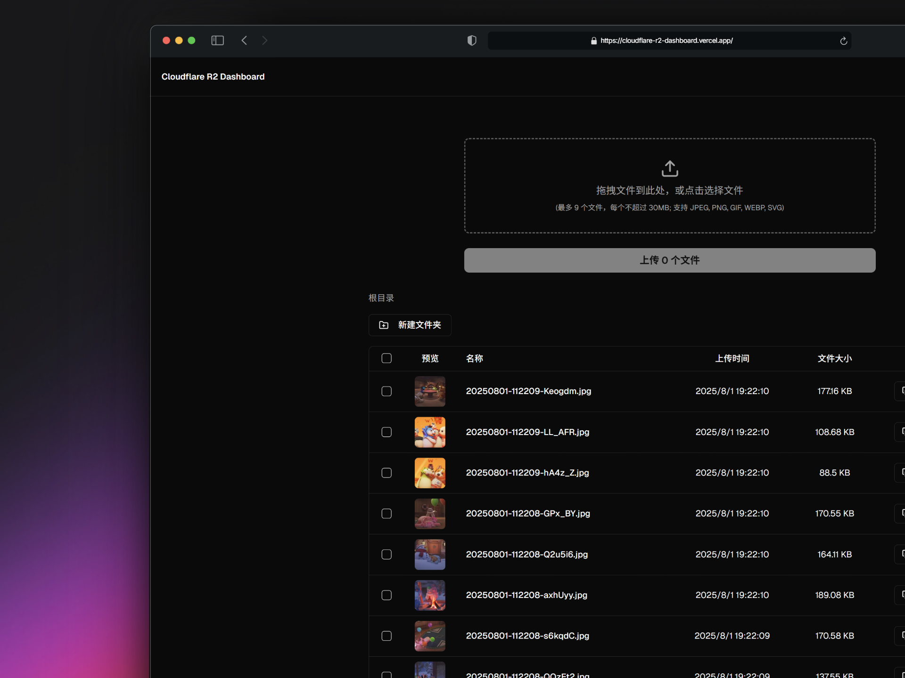

# 🗂️ Cloudflare R2 文件管理面板

这是一个基于 Next.js, Tailwind CSS 和 Supabase 构建的现代化、安全且用户友好的 Web 界面，用于管理存储在 Cloudflare R2 存储桶中的文件。项目已配置为通过 Vercel 进行一键式部署。



## ✨ 功能亮点

- **📊 用量概览**: 在首页提供一个仪表盘，实时显示 R2 存储用量、Class A 和 Class B 操作的当月累计次数，帮助您监控资源消耗和成本。
- **🔒 安全认证**: 通过 Supabase Auth 实现用户登录，只有授权用户才能访问。
- **📂 文件夹管理**:
  - 支持创建和删除文件夹，实现文件有组织的存储。
  - 通过面包屑导航清晰地展示当前路径，并支持快速返回上级目录。
- **📤 文件上传**:
  - 支持拖拽或点击选择多个文件。
  - 实时显示每个文件的上传进度。
  - 支持文件大小、数量和类型的限制。
  - 上传成功或失败后提供清晰的 Toast 通知。
- **📋 文件列表与操作**:
  - 以表格形式清晰展示文件夹和文件，文件元数据（如上传者、大小、上传时间）由 Supabase 管理。
  - 支持对文件进行多选和批量删除，并根据用户权限进行控制。
  - 一键复制文件的公开访问链接。
- **🖼️ 图片预览**:
  - 文件列表中显示图片的缩略图。
  - 点击缩略图可查看高分辨率的图片预览。
- **🎨 动态主题**:
  - 支持亮色、暗色和跟随系统三种主题模式。
  - 应用的整体外观和图片预览会根据主题动态调整。

## 🛠️ 技术栈

| 分类            | 技术/服务                                                               |
| --------------- | ----------------------------------------------------------------------- |
| **框架**        | [Next.js](https://nextjs.org/) 14 (App Router)                          |
| **语言**        | [TypeScript](https://www.typescriptlang.org/)                           |
| **样式**        | [Tailwind CSS](https://tailwindcss.com/)                                |
| **UI 组件**     | [shadcn/ui](https://ui.shadcn.com/)                                     |
| **数据请求**    | [SWR](https://swr.vercel.app/)                                          |
| **认证/数据库** | [Supabase](https://supabase.com/) (Auth & Postgres DB)                  |
| **对象存储**    | [Cloudflare R2](https://www.cloudflare.com/products/r2/)                |
| **云服务接口**  | [AWS SDK for JavaScript v3](https://aws.amazon.com/sdk-for-javascript/) |
| **部署平台**    | [Vercel](https://vercel.com/)                                           |

## 🚀 本地开发指南

请按照以下步骤在本地运行此项目。

### 1. 克隆仓库

```bash
git clone https://github.com/chiperman/cloudflare-r2-dashboard.git
cd cloudflare-r2-dashboard
```

### 2. 安装依赖

```bash
npm install
# 或者使用 pnpm / yarn
# pnpm install
# yarn install
```

### 3. 配置环境变量

首先，将环境变量模板文件复制一份，并重命名为 `.env.local`。

```bash
cp .env.example .env.local
```

然后，编辑 `.env.local` 文件，填入你自己的配置信息。

```env
# .env.local

# Supabase
# 从你的 Supabase 项目设置 > API 中获取
NEXT_PUBLIC_SUPABASE_URL=https://your-supabase-url.supabase.co
NEXT_PUBLIC_SUPABASE_ANON_KEY=your-anon-key
SUPABASE_SERVICE_ROLE_KEY=your-supabase-service-role-key

# Cloudflare R2 (S3-compatible)
# 从你的 Cloudflare R2 控制台获取
R2_ACCOUNT_ID=your-account-id
R2_ACCESS_KEY_ID=your-access-key-id
R2_SECRET_ACCESS_KEY=your-secret-access-key
R2_BUCKET_NAME=your-bucket-name
```

- **`NEXT_PUBLIC_SUPABASE_URL` / `NEXT_PUBLIC_SUPABASE_ANON_KEY`**: 用于连接到您的 Supabase 项目以进行用户认证。
- **`SUPABASE_SERVICE_ROLE_KEY`**: 您的 Supabase 服务角色密钥，用于服务器端操作（如文件元数据回填脚本）和绕过行级安全策略。
- **`R2_ACCOUNT_ID`**: 您的 Cloudflare 账户 ID。
- **`R2_ACCESS_KEY_ID` / `R2_SECRET_ACCESS_KEY`**: 您创建的 R2 API 令牌的访问密钥。
- **`R2_BUCKET_NAME`**: 您希望管理的 R2 存储桶的名称。
- **`CLOUDFLARE_API_TOKEN`**: 用于从 Cloudflare GraphQL API 获取 R2 用量指标。您需要创建一个 API 令牌，并为其分配以下两个权限：
  - `Account` > `R2` > `Read`
  - `Account` > `Account Analytics` > `Read`

### 4. 设置数据库

本项目使用 Supabase 自带的 Postgres 数据库来索引文件元数据，以支持按上传时间排序等高级功能。

1.  登录到你的 [Supabase 项目仪表盘](https://supabase.com/dashboard)。
2.  在左侧菜单中，进入 **SQL Editor**。
3.  点击 **+ New query**。
4.  打开项目中的 `supabase/schema.sql` 文件，将其中的 SQL 内容完整复制并粘贴到编辑器中。
5.  点击 **RUN** 按钮执行脚本。这将创建 `files` 表并设置好行级安全策略。

### 5. 运行开发服务器

```bash
npm run dev
```

现在，在浏览器中打开 [http://localhost:3000](http://localhost:3000) 就可以看到正在运行的应用了。

## 🌐 部署到 Vercel

本项目已为 Vercel 部署进行了优化。

1.  **推送代码**: 将你的代码推送到 GitHub 仓库。
2.  **导入项目**: 在 Vercel 控制台，选择 "Add New..." -> "Project"，然后选择你刚刚推送的 GitHub 仓库并点击 "Import"。
3.  **配置环境变量**: 在 "Configure Project" 页面，展开 "Environment Variables" 选项卡。将你在 `.env.local` 文件中配置的所有变量和值一一添加到这里。**这是部署成功的关键步骤。**
4.  **部署**: 点击 "Deploy" 按钮。Vercel 将自动构建并部署你的应用。

部署成功后，每次 `git push` 到 `main` 分支，Vercel 都会自动触发一次新的部署。

## 🚀 性能优化

### 问题诊断

通过对 `/api/files/route.ts` 的代码分析，我们发现文件列表加载缓慢的根本原因在于**数据库查询效率低下**，而非原先猜测的 R2 实时列表。

性能瓶颈具体表现为：**获取文件夹列表的方式极其低效**。

当前后端为了获取 `prefix/` 路径下的文件夹，会执行一个 `LIKE 'prefix%/%'` 查询，这个查询会匹配所有深层路径下的文件（例如 `prefix/folder1/file.txt`, `prefix/folder2/sub/another.txt` 等），将它们全部返回给 API 服务器，然后由服务器在内存中进行字符串切割、去重，最后才得到 `folder1` 和 `folder2` 这两个目录。

当子孙文件数量庞大时，这个过程会给数据库和服务器带来巨大压力，导致 API 响应缓慢。

### 优化目标

用最高效的方式重构 API，将文件夹和文件的查询逻辑下推到数据库层面，使 API 响应时间与文件总量脱钩，即使在百万级文件规模下，也能实现毫秒级响应。

### 实施逻辑

优化的核心思想是将计算密集型的文件夹列表获取操作从 Node.js 服务器下推到 PostgreSQL 数据库中高效执行。

1.  **数据库端**: 创建了一个名为 `get_directories_in_prefix` 的 SQL 函数。该函数直接在数据库中处理 `files` 表，通过字符串操作高效地提取出给定路径下的所有一级子目录，避免了将成千上万条文件记录传输到服务器进行计算的开销。相关的索引也已添加以加速查询。完整的实现细节请参见 `supabase/schema.sql`。

2.  **API 服务端**: 重构了 `/api/files/route.ts` 中的 `GET` 方法。现在，它会使用 `Promise.all` 并行执行两个数据库查询：一个用于获取当前目录下的文件（支持分页），另一个则调用上述的 `get_directories_in_prefix` 函数来获取文件夹列表。这种并行处理进一步缩短了 API 的响应时间。

### 预期效果

- **数量级提升**：API 响应时间将从数秒甚至更长，降低到毫秒级别。
- **降低数据库负载**：将计算下推到数据库，并使用高效查询，显著减少数据库的 CPU 和内存消耗。
- **提升应用扩展性**：即时未来文件数量增长到数百万，应用性能也能保持稳定。
- **代码更清晰**：API 路由的职责更单一，代码可读性和可维护性增强。